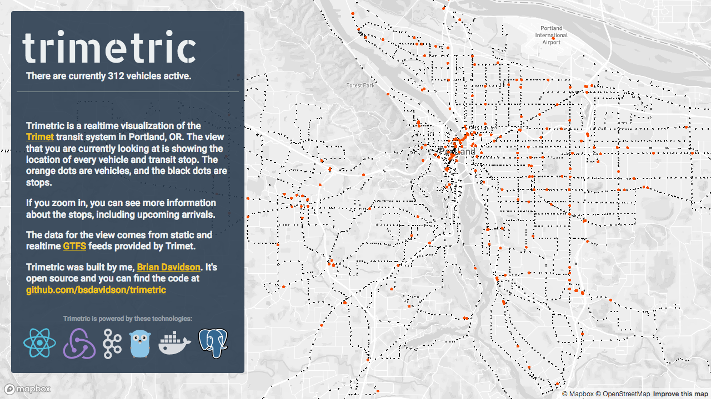
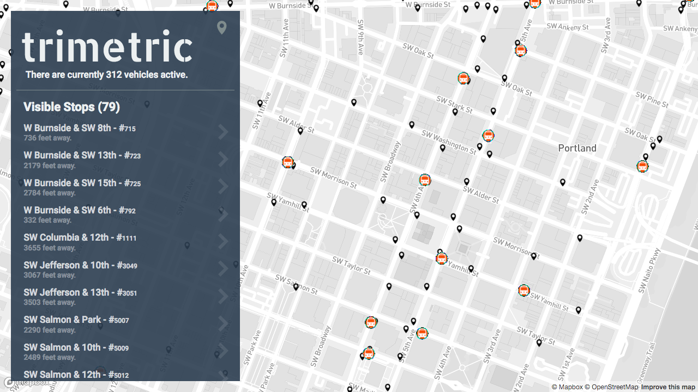
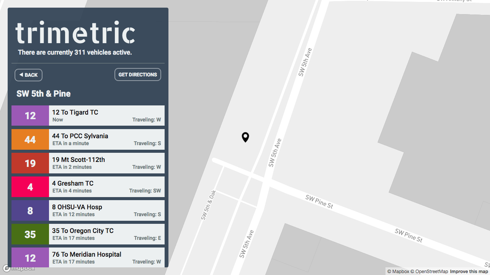
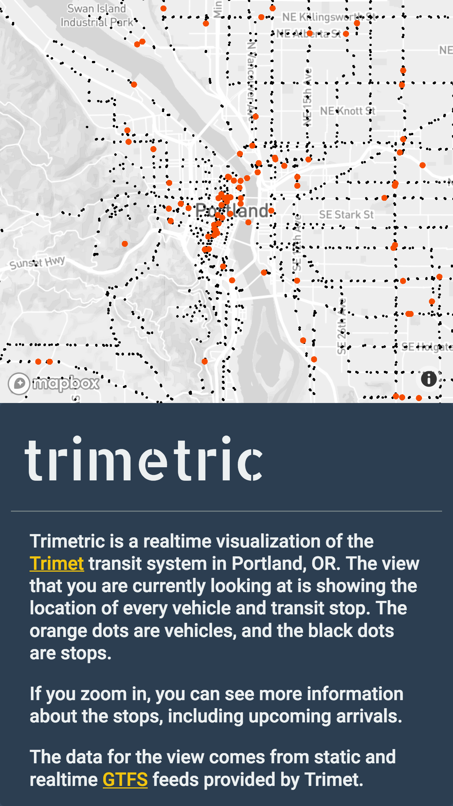

# trimetric

Trimetric is a realtime visualization of the [Trimet] transit system in
Portland, OR, using the [GTFS] feeds provided for developers by Trimet.

It downloads the static GTFS feeds periodically and ingests them into the local
[Postgres] database. Realtime GTFS data, such as vehicle position and trip
updates, are polled and produced into [Kafka], where it is consumed by other
workers.

The front end is a responsive web app built in React and uses [Mapbox] and
[deck.gl] for rendering the map and icon layers. When zoomed in, Trimetric shows
you a dynamic list of the stops that are visible on screen, which you can click
to see upcoming arrivals.

### Demo

You can view Trimetric online at: https://trimetric.briand.co


### Screenshots

<br />





### Running

You can run Trimetric locally using Docker Compose. You'll need:

- [Mapbox Access Token] (free)
- [Trimet API Key] (free)
- [Docker] and [Docker Compose]

Then run the following to get things up and running:

```sh
git clone https://github.com/bsdavidson/trimetric.git
cd trimetric
mkdir secrets
echo MAPBOX_ACCESS_TOKEN=<your_mapbox_token> > web/.env
echo <your_trimet_api_key> > secrets/trimet-api-key
echo example > secrets/postgres-password
echo INFLUXDB_USER_PASSWORD=example > secrets/influxdb.env
docker-compose up
```

You should see the logs from Docker Compose in the terminal. All the
dependencies will be started automatically and the local directories will be
mounted in the containers for easy development. The API and web app will be
rebuilt automatically when you make changes. You can view the running web app in
your browser by opening: http://localhost:8080


[Trimet]: https://trimet.org
[GTFS]: https://developers.google.com/transit/
[Postgres]: https://www.postgresql.org/
[Kafka]: https://kafka.apache.org/
[Mapbox]: https://www.mapbox.com/
[deck.gl]: https://uber.github.io/deck.gl/
[Mapbox Access Token]: https://www.mapbox.com/signup/
[Trimet API Key]: https://developer.trimet.org/appid/registration/
[Docker]: https://www.docker.com/
[Docker Compose]: https://docs.docker.com/compose/
