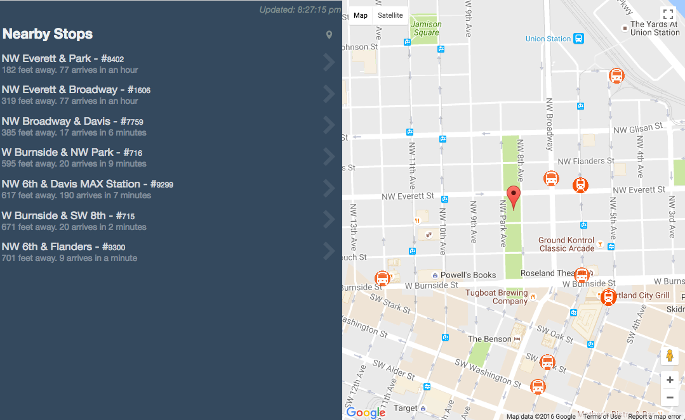
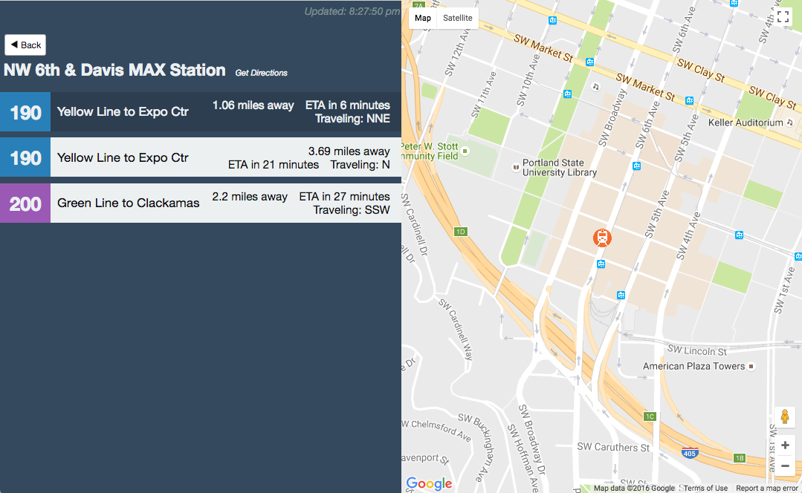
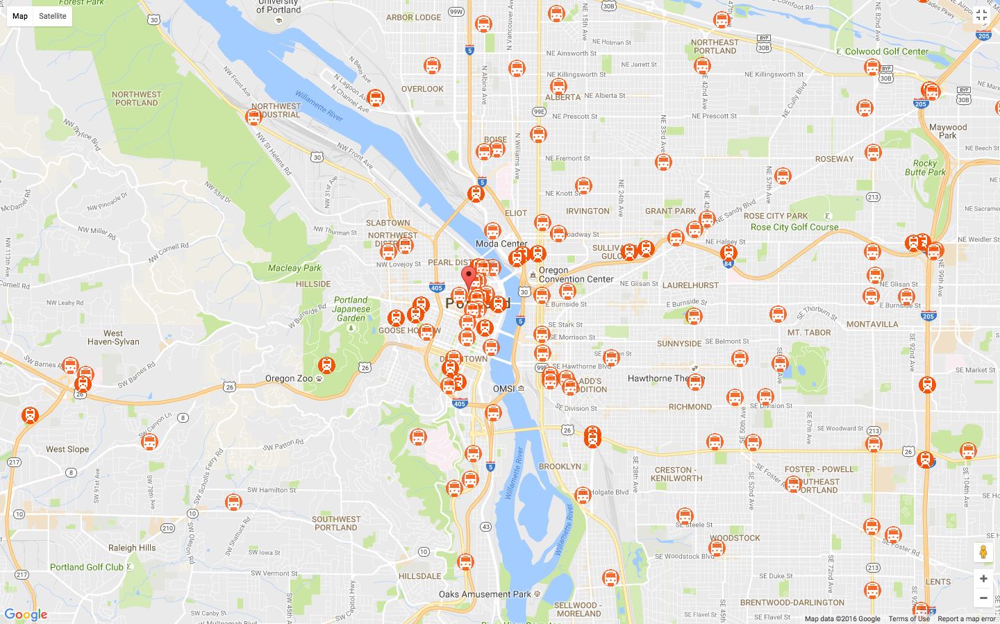

# trimetric
  Real-time tracking of upcoming Trimet buses and trains near you.

[DEMO](https://briand.co/trimetric)

## Features
  - Shows stops near your location
  - See whats coming next at a particular stop.
  - See where the buses and trains are... all of them.
  - Click one and follow it around the city using Google Maps.

## TODO
  - Show Route info
  - Home location handling
  - Remember settings






### What you will need:
  - [Google Maps API Key](http://stackoverflow.com/questions/22294128/how-can-i-get-google-map-api-v3-key)
  - [Trimet Developer Key](https://developer.trimet.org/appid/registration/)
    (both are free)


### Setup

```sh
git clone https://github.com/bsdavidson/trimetric.git

yarn install

```
Edit .env and enter your Google Maps API Key and Trimet Developer Key


### Commands

Start webpack dev server and Karma
```sh
$ yarn run watch
```

Build a copy for web distribution
```sh
$ yarn run dist
```
